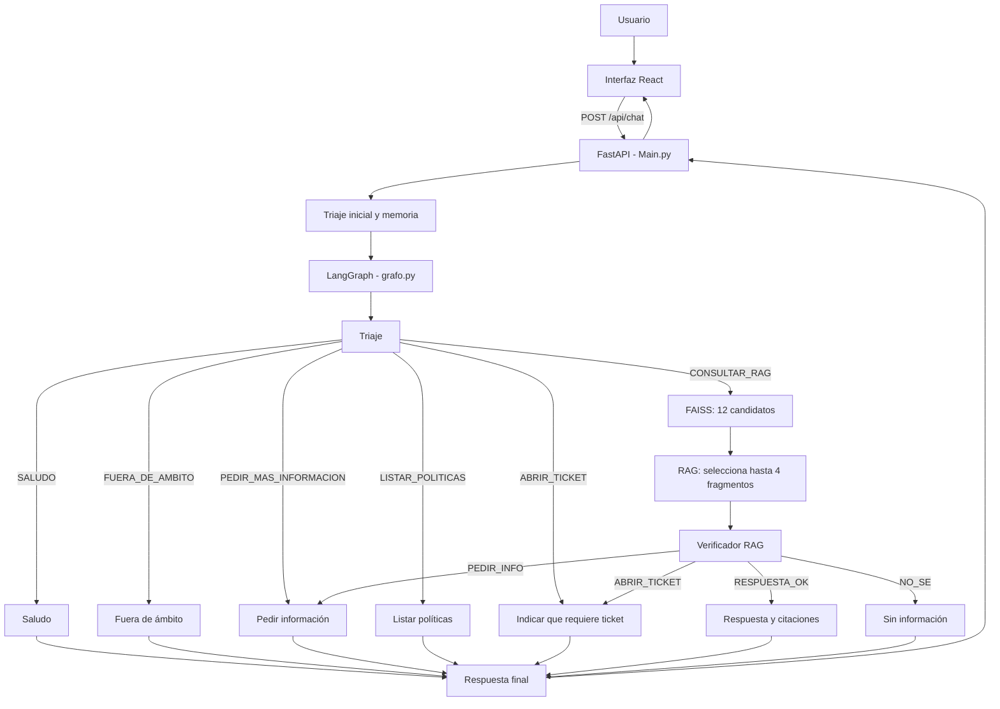
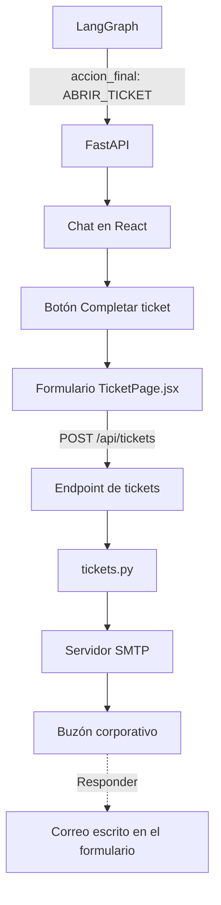

# 🤖 Agente de Políticas Corporativas de Nexus Logistics & Tech

Aplicación web con inteligencia artificial que responde consultas sobre las
políticas internas de Nexus Logistics & Tech. El sistema clasifica cada
mensaje, busca información en documentos PDF mediante RAG, verifica la
respuesta y muestra las fuentes utilizadas.

Cuando una solicitud necesita una gestión real, el agente no envía el ticket
automáticamente. Primero muestra un formulario para que el usuario revise y
complete la información. El correo se envía únicamente después de confirmar el
formulario.

## 🧾 Origen y adaptación del proyecto

Este proyecto parte de una base técnica existente (agente RAG con FastAPI,
LangGraph, FAISS y React) desarrollada originalmente para otra organización.
A partir de esa base se adaptó a un dominio y una empresa distintos —
**Nexus Logistics & Tech**, una empresa ficticia de logística y tecnología —
reemplazando por completo el corpus documental, los prompts del agente, la
identidad visual y los ejemplos de clasificación, y ajustando partes del
código según las necesidades del nuevo dominio (más detalle en las secciones
siguientes).

## ✨ Funcionalidades principales

- Chat web para consultar las políticas corporativas.
- Clasificación de mensajes mediante un triaje con IA.
- Memoria conversacional de corto plazo por sesión.
- Búsqueda semántica sobre documentos PDF con FAISS.
- Generación de respuestas mediante Cohere o Gemini.
- Verificación de respuestas para reducir información no respaldada.
- Citaciones con fragmento, archivo de origen y número de página.
- Listado directo de todas las políticas disponibles.
- Formulario para revisar y enviar solicitudes que requieren gestión.
- Envío de tickets por correo mediante SMTP.
- API REST documentada automáticamente con FastAPI.
- Suite de 45 casos de prueba para triaje, RAG y memoria.

## 🛠️ Tecnologías

| Capa | Tecnologías |
| --- | --- |
| Frontend | Node.js 22.12.0, React 19, Vite 7, Framer Motion, Lucide React y React Markdown |
| API | Python 3.13.2 en desarrollo local, FastAPI, Uvicorn y Pydantic |
| Orquestación | LangGraph y LangChain |
| Modelos de IA | Cohere o Google Gemini |
| Búsqueda RAG | FAISS, embeddings y recuperación semántica |
| Documentos | PyMuPDF, Transformers y tokenizador de Hugging Face |
| Tickets | SMTP y correo electrónico |
| Despliegue | Docker y Render |

## 🏛️ Arquitectura del sistema

React contiene la interfaz gráfica y FastAPI sirve tanto la API como el
frontend compilado. LangGraph se utiliza para decidir cómo responder una
consulta. El formulario de tickets y el envío del correo funcionan fuera del
grafo porque no necesitan una decisión adicional de la IA.

### Flujo de consultas con IA



El diagrama generado directamente por LangGraph se encuentra en
[`grafo_agente.png`](grafo_agente.png).

### Flujo del formulario de tickets



En este flujo:

1. LangGraph solo decide que la solicitud necesita un ticket.
2. FastAPI devuelve `accion_final: ABRIR_TICKET` al frontend.
3. React muestra el botón **Completar ticket**.
4. El usuario revisa la pregunta y completa sus datos.
5. El formulario llama a `POST /api/tickets`.
6. `tickets.py` envía el mensaje desde la cuenta técnica hacia el buzón
   corporativo.
7. El correo del usuario se coloca como `Reply-To` para que el área responsable
   pueda responderle.

Por lo tanto, el formulario, el endpoint de tickets y SMTP no forman parte del
grafo de LangGraph.

## 🔎 Funcionamiento del RAG

1. El frontend envía la pregunta y el identificador de conversación.
2. El triaje clasifica la intención del mensaje.
3. Si la pregunta depende de mensajes anteriores, la memoria la convierte en
   una consulta autónoma y se vuelve a clasificar.
4. El grafo selecciona la ruta correspondiente.
5. Para una consulta documental, FAISS recupera 12 fragmentos candidatos.
6. `busqueda_rag.py` reordena los candidatos y conserva hasta 4 fragmentos.
7. El LLM genera una respuesta utilizando el contexto recuperado.
8. El verificador comprueba que la respuesta atienda la pregunta y tenga
   respaldo documental.
9. FastAPI devuelve la respuesta, la acción final, el triaje y las citaciones.

Las rutas como saludo, listado de políticas o solicitud de más información no
necesitan consultar FAISS.

## 📂 Estructura del proyecto

```text
Backend/
├── Main.py
├── config.py
├── providers.py
├── triaje.py
├── grafo.py
├── busqueda_rag.py
├── memoria.py
├── documentos.py
├── vectorstore.py
├── tickets.py
├── test_agente_ligero.py
├── reporte_pruebas.md
├── requirements.txt
├── Dockerfile
├── .env.example
├── Documentos/
├── faiss_indexv2/
└── frontend/
    ├── src/
    │   ├── App.jsx
    │   ├── TicketPage.jsx
    │   ├── main.jsx
    │   └── styles.css
    ├── public/
    ├── package.json
    ├── package-lock.json
    └── vite.config.js
```

`frontend/dist/` es una carpeta generada por `npm run build`. FastAPI sirve su
contenido cuando la aplicación se ejecuta con `python Main.py`.

## 📄 Archivos importantes

| Archivo o carpeta | Función |
| --- | --- |
| `Main.py` | Inicializa los componentes, define los endpoints y sirve el frontend. |
| `config.py` | Lee la configuración de IA, RAG, documentos y correo. |
| `providers.py` | Construye el LLM y los embeddings de Cohere o Gemini. |
| `triaje.py` | Clasifica la intención, urgencia, datos faltantes y uso del historial. |
| `grafo.py` | Define los nodos, decisiones y rutas de LangGraph. |
| `busqueda_rag.py` | Recupera fragmentos, genera una respuesta y la verifica. |
| `memoria.py` | Guarda el historial corto y condensa preguntas dependientes. |
| `documentos.py` | Lee los PDF y los divide en fragmentos cuando se reconstruye el índice. |
| `vectorstore.py` | Carga, valida o reconstruye el índice FAISS. |
| `tickets.py` | Valida el formulario, genera un código de referencia y envía el correo. |
| `Documentos/` | Contiene las políticas corporativas en PDF. |
| `faiss_indexv2/` | Contiene el índice vectorial y su manifiesto de validación. |
| `frontend/src/App.jsx` | Contiene el chat y consume `/api/chat`. |
| `frontend/src/TicketPage.jsx` | Contiene el formulario y consume `/api/tickets`. |
| `frontend/src/styles.css` | Define los estilos del chat y del formulario. |
| `test_agente_ligero.py` | Ejecuta los 45 casos de prueba. |
| `reporte_pruebas.md` | Guarda el resultado de las pruebas ejecutadas. |
| `Dockerfile` | Compila React y prepara FastAPI para producción. |
| `.env.example` | Plantilla sin credenciales para crear el archivo privado `.env`. |
| `INSTRUCCIONES_TICKETS.md` *(histórico)* | Documentó inicialmente la instalación y el funcionamiento de los tickets por correo. |

`INSTRUCCIONES_TICKETS.md` fue agregado en el commit `cb115d5`. Posteriormente,
su contenido se integró en este README y el archivo fue retirado en el commit
`c1018e3`. Aunque ya no aparece en la estructura actual, permanece disponible
en el historial de Git.

## ⚙️ Requisitos previos

La forma normal de ejecutar el proyecto en Windows es con `python Main.py`.
Para eso se necesita:

- Windows 10 u 11.
- Python 3.13.2.
- Una clave válida de Cohere o Gemini.
- Git solamente si se clonará el repositorio. También puede descargarse como
  ZIP.
- Una cuenta de correo con SMTP solamente si se probará el formulario de
  tickets.

`frontend/dist` ya está incluido en las ramas `main` y `Api-Agente`. Por eso
**Node.js no es necesario para abrir la aplicación existente**. Node.js
22.12.0 y npm solo son necesarios si se modificará y volverá a compilar el
frontend.

Docker tampoco es obligatorio para trabajar localmente. El `Dockerfile` se
utiliza principalmente para el despliegue en Render y queda como una alternativa
opcional al final del README.

## 🔐 Configuración privada

La aplicación utiliza variables privadas para el proveedor de IA y el envío de
correos. Los valores reales deben guardarse únicamente en el archivo `.env`
local y en **Render > Environment**.

El repositorio incluye `.env.example`, que contiene todos los nombres de las
variables sin incluir claves ni contraseñas. Cada usuario debe copiar esa
plantilla con el nombre `.env` y completar sus propias credenciales.

Variables principales de IA:

- `LLM_PROVIDER`
- `COHERE_API_KEY` o `GEMINI_API_KEY`
- `EMBEDDINGS_PROVIDER`
- Modelos y tiempos de espera del proveedor seleccionado

Variables principales de correo:

- `SMTP_HOST`
- `SMTP_PORT`
- `SMTP_USER`
- `SMTP_APP_PASSWORD`
- `TICKET_DESTINO`
- `SMTP_TIMEOUT_SECONDS`

`SMTP_USER` es la cuenta técnica que envía el mensaje. El correo escrito en el
formulario identifica al solicitante y se utiliza como `Reply-To`.

> No se deben subir contraseñas, claves de API ni el archivo `.env` a GitHub.

## 📥 Instalación en Windows

Esta es la instalación recomendada para un usuario que descarga el proyecto por
primera vez. No se necesita Docker y, mientras no se modifique el frontend,
tampoco se necesita Node.js.

### Paso 1. Instalar y comprobar Python

Instalar [Python 3.13.2 para Windows](https://www.python.org/downloads/release/python-3132/).
Durante la instalación se debe
marcar **Add Python to PATH**.

Después, cerrar la ventana de PowerShell, abrir una nueva y ejecutar:

```powershell
python --version
```

Debe aparecer una versión de Python 3.13, por ejemplo:

```text
Python 3.13.2
```

Si aparece `python no se reconoce`, Python no se agregó al `PATH`. Se debe
reabrir el instalador, activar **Add Python to PATH** y abrir PowerShell
nuevamente.

### Paso 2. Descargar el repositorio

```powershell
git clone https://github.com/grisherm/Polices_Agent.git
cd Polices_Agent
```

Sin Git:

1. Abrir el [repositorio en GitHub](https://github.com/grisherm/Polices_Agent).
2. Presionar **Code** y después **Download ZIP**.
3. Descomprimir el ZIP.
4. Abrir la carpeta extraída y seleccionar **Abrir en Terminal**.

### Paso 3. Verificar la carpeta del proyecto

En PowerShell ejecutar:

```powershell
Get-ChildItem Main.py, requirements.txt, .env.example
```

Deben aparecer los tres archivos. Si no aparecen, la terminal está en una
carpeta equivocada.

### Paso 4. Crear y activar el entorno virtual

Crear el entorno:

```powershell
python -m venv .venv
```

Permitir la activación solamente durante la terminal actual y activarlo:

```powershell
Set-ExecutionPolicy -Scope Process -ExecutionPolicy RemoteSigned
.\.venv\Scripts\Activate.ps1
```

Cuando se activa correctamente, PowerShell muestra `(.venv)` al inicio de la
línea.

Si el entorno ya existía, no se vuelve a crear; solamente se ejecutan los dos
comandos de activación.

### Paso 5. Instalar las librerías de Python

Con `(.venv)` visible en PowerShell:

```powershell
python -m pip install --upgrade pip
python -m pip install -r requirements.txt
```

Este comando instala FastAPI, Uvicorn, LangChain, LangGraph, FAISS, Cohere,
Gemini, PyMuPDF y las demás dependencias del backend. Solo es necesario
repetirlo si cambia `requirements.txt` o se crea otro entorno virtual.

### Paso 6. Crear el archivo `.env`

Copiar la plantilla incluida en el repositorio:

```powershell
Copy-Item .env.example .env
notepad .env
```

Para utilizar Cohere, completar como mínimo:

```env
LLM_PROVIDER=cohere
EMBEDDINGS_PROVIDER=cohere
COHERE_API_KEY=COLOCAR_AQUI_LA_CLAVE_PERSONAL
COHERE_CHAT_MODEL=command-a-03-2025
COHERE_EMBEDDING_MODEL=embed-v4.0
```

Para enviar tickets también se deben completar:

```env
SMTP_HOST=smtp.gmail.com
SMTP_PORT=587
SMTP_USER=correo_tecnico@gmail.com
SMTP_APP_PASSWORD=CONTRASENA_DE_APLICACION
TICKET_DESTINO=correo_que_recibe_los_tickets@gmail.com
SMTP_TIMEOUT_SECONDS=30
```

Las variables SMTP pueden quedar vacías si solo se probará el chat. El correo
escrito por el usuario en el formulario no reemplaza `SMTP_USER`: se usa como
`Reply-To` para que el área responsable pueda responderle.

El archivo debe llamarse exactamente `.env`, no `.env.txt`. Se comprueba con:

```powershell
Get-ChildItem -Force .env*
```

### Paso 7. Ejecutar toda la aplicación

Con `(.venv)` visible y desde la carpeta que contiene `Main.py`:

```powershell
python Main.py
```

No se necesita abrir otra terminal ni ejecutar React por separado. `Main.py`:

1. Inicia FastAPI.
2. Carga el LLM, los embeddings y el índice FAISS.
3. Sirve el frontend ya compilado desde `frontend/dist`.
4. Expone el chat y los endpoints desde el mismo puerto.

La aplicación está lista cuando aparece:

```text
Application startup complete.
Uvicorn running on http://0.0.0.0:8000
```

Abrir en el navegador:

- Aplicación completa: `http://localhost:8000`
- Estado del servicio: `http://localhost:8000/health`
- Documentación Swagger: `http://localhost:8000/docs`

El primer arranque puede tardar mientras se cargan los componentes. Para
detener la aplicación se presiona `Ctrl + C` en PowerShell.

### Errores frecuentes en Windows

| Error | Solución |
| --- | --- |
| `python no se reconoce` | Instalar Python marcando **Add Python to PATH** y abrir otra ventana de PowerShell. |
| `running scripts is disabled on this system` | Ejecutar `Set-ExecutionPolicy -Scope Process -ExecutionPolicy RemoteSigned` y volver a activar `.venv`. |
| `No module named ...` | Activar `.venv` y ejecutar `python -m pip install -r requirements.txt`. |
| `Falta COHERE_API_KEY` o `Falta GEMINI_API_KEY` | Revisar que `.env` tenga la clave del proveedor seleccionado. |
| La página muestra que el frontend no está compilado | Comprobar que existe `frontend/dist`. Si fue eliminado, seguir la sección de desarrollo del frontend para reconstruirlo. |
| El puerto 8000 está ocupado | Cerrar el otro servidor o cambiar `PORT=8001` en `.env` y abrir `http://localhost:8001`. |
| Error SMTP `535` | Utilizar una contraseña de aplicación de Gmail, no la contraseña normal. |

## 💻 Desarrollo del frontend

Esta sección solo es necesaria si se modificará React. Para ejecutar la versión
actual basta con `python Main.py`.

1. Instalar [Node.js 22.12.0](https://nodejs.org/en/blog/release/v22.12.0).
2. Abrir una terminal nueva y comprobarlo:

   ```powershell
   node --version
   npm --version
   ```

3. Instalar las dependencias del frontend y generar `frontend/dist`:

   ```powershell
   cd frontend
   npm install
   npm run build
   cd ..
   ```

Para trabajar con recarga automática, dejar `python Main.py` ejecutándose en
una primera terminal. En una segunda terminal ejecutar:

```powershell
cd frontend
npm run dev
```

Mientras `npm run dev` esté activo, la versión de desarrollo se abre en
`http://localhost:5173`. Vite redirige `/api` y `/health` hacia FastAPI, que
continúa ejecutándose en el puerto `8000`.

Este modo se utiliza solamente mientras se modifica el frontend. En la
ejecución normal, FastAPI sirve la interfaz compilada directamente en
`http://localhost:8000`; no es necesario abrir el puerto `5173`.

Después de modificar el frontend, ejecuta nuevamente `npm run build` si deseas
probarlo directamente desde `python Main.py`.

## 🚀 Uso de la aplicación

### Consulta documental

Ejemplo:

> ¿Qué establece la política corporativa sobre los regalos de proveedores?

El agente buscará información en FAISS, verificará la respuesta y mostrará las
fuentes consultadas.

### Solicitud de ticket

Ejemplo:

> Registra una denuncia porque un proveedor me ofreció dinero. Abre un ticket.

El agente devolverá `ABRIR_TICKET`. La interfaz mostrará el formulario, pero el
correo no se enviará hasta que el usuario presione **Enviar ticket**.

El código mostrado después del envío es un código de referencia incluido en el
correo. No permite consultar estados porque el proyecto no utiliza una base de
datos de tickets.

## 🔌 Endpoints principales

| Método | Ruta | Descripción |
| --- | --- | --- |
| `GET` | `/health` | Indica si el agente terminó de inicializarse. |
| `GET` | `/api/politicas` | Lista las políticas disponibles. |
| `POST` | `/api/triaje` | Clasifica una pregunta sin ejecutar el RAG. |
| `POST` | `/api/chat` | Ejecuta memoria, LangGraph, RAG y verificación. |
| `POST` | `/api/tickets` | Valida el formulario y envía el ticket por correo. |
| `DELETE` | `/api/chat/historial/{thread_id}` | Elimina el historial de una sesión. |

Acciones finales posibles:

- `SALUDO`
- `FUERA_DE_AMBITO`
- `PEDIR_INFO`
- `LISTAR_POLITICAS`
- `AUTO_RESOLVER`
- `SIN_INFORMACION`
- `ABRIR_TICKET`

## 🧪 Pruebas automatizadas

La suite contiene 45 casos de triaje, RAG y memoria. Primero debe iniciarse el
backend:

```bash
python Main.py
```

En una segunda terminal:

```bash
python test_agente_ligero.py
```

Comandos útiles:

```bash
# Solo triaje
python test_agente_ligero.py --grupo triaje

# Solo RAG y memoria
python test_agente_ligero.py --grupo rag

# Casos específicos
python test_agente_ligero.py --desde 1 --hasta 10

# Cambiar el perfil de pausas
python test_agente_ligero.py --modo normal
python test_agente_ligero.py --modo rapido
```

Los modos disponibles son `ligero`, `normal` y `rapido`. El resultado se guarda
en `reporte_pruebas.md` después de cada caso completado.

### Resultado documentado

El reporte disponible corresponde a una ejecución parcial de cuatro casos. No representa todavía la ejecución completa de los 45 casos definidos.

| Métrica | Resultado |
| --- | ---: |
| Casos ejecutados | 4 |
| Casos aprobados | 4 |
| Casos fallidos | 0 |
| Tasa de éxito de la ejecución | **100 %** |

| Caso | Categoría | Acción esperada | Acción obtenida | Estado |
| ---: | --- | --- | --- | --- |
| 38 | Triaje: abrir ticket | `ABRIR_TICKET` | `ABRIR_TICKET` | PASS |
| 39 | Triaje: abrir ticket | `ABRIR_TICKET` | `ABRIR_TICKET` | PASS |
| 40 | Triaje: abrir ticket | `ABRIR_TICKET` | `ABRIR_TICKET` | PASS |
| 41 | Memoria y RAG sobre regalos | `AUTO_RESOLVER` | `AUTO_RESOLVER` | PASS |

El caso 41 produjo una respuesta útil respaldada por cuatro citaciones. El detalle de las preguntas, respuestas, tiempos y validaciones se encuentra en [reporte_pruebas.md](reporte_pruebas.md).

## 🐳 Docker en Windows (opcional)

**Docker no es necesario para ejecutar el proyecto normalmente.** Si el usuario
ya instaló Python y siguió la sección anterior, solamente debe usar:

```powershell
python Main.py
```

El `Dockerfile` permite ejecutar el proyecto en un contenedor como alternativa
a la instalación local, y sirve como base para un eventual despliegue en un
proveedor cloud (Render, Railway, etc.).

Si un usuario decide utilizar Docker en Windows:

1. Instalar [Docker Desktop](https://docs.docker.com/desktop/setup/install/windows-install/)
   siguiendo su instalador.
2. Abrir Docker Desktop y esperar a que termine de iniciar.
3. Comprobarlo en PowerShell:

   ```powershell
   docker version
   ```

4. Crear y completar `.env` como se explicó anteriormente.
5. Desde la carpeta donde está `Dockerfile`, construir la imagen:

   ```powershell
   docker build -t agente-nexus .
   ```

6. Cuando la construcción termine, iniciar el contenedor:

   ```powershell
   docker run --rm --name agente-nexus --env-file .env -p 8000:8000 agente-nexus
   ```

7. Abrir `http://localhost:8000`.
8. Para detenerlo, presionar `Ctrl + C`.

Dentro del contenedor, el `Dockerfile` ejecuta automáticamente `python Main.py`.
Por eso no se debe ejecutar ese comando por separado cuando se utiliza Docker.

Errores básicos:

| Error | Solución |
| --- | --- |
| `docker no se reconoce` | Docker Desktop no está instalado o falta abrir una terminal nueva. |
| `Cannot connect to the Docker daemon` | Abrir Docker Desktop y esperar a que inicie. |
| No encuentra `.env` | Crear `.env` desde `.env.example` en la raíz del proyecto. |
| El puerto 8000 está ocupado | Usar `-p 8080:8000` y abrir `http://localhost:8080`. |

## ☁️ Despliegue en la nube (opcional)

El proyecto no tiene actualmente un despliegue activo público. El `Dockerfile`
y `railway.toml` incluidos permiten desplegarlo en un proveedor cloud (Render,
Railway u otro) que instale las dependencias, compile React y ejecute
`python Main.py`. La aplicación lee la variable `PORT` provista por el
proveedor y sirve el frontend y la API desde el mismo dominio.

> Algunos proveedores bloquean los puertos SMTP `25`, `465` y `587` en sus
> planes gratuitos. En ese caso el chat puede funcionar, pero el envío de
> tickets por Gmail SMTP no. Para habilitarlo en producción se necesita una
> instancia compatible o un servicio de correo mediante API HTTPS.

## ⚠️ Consideraciones actuales

- La memoria conversacional se guarda en RAM y se pierde al reiniciar el
  servicio.
- El índice FAISS se reutiliza mientras coincidan los PDF y el modelo de
  embeddings.
- Si cambian los documentos o embeddings, el índice se reconstruye.
- Las pruebas realizan llamadas reales al proveedor de IA y pueden consumir
  cuota.
- Los tickets se envían por correo, pero no se guardan en una base de datos.
- El código del ticket es una referencia para buscar el correo, no un sistema
  de seguimiento de estados.
- No existe autenticación de usuarios ni una mesa de ayuda integrada.
- No se deben ejecutar varias suites intensivas al mismo tiempo contra el mismo
  servicio.
